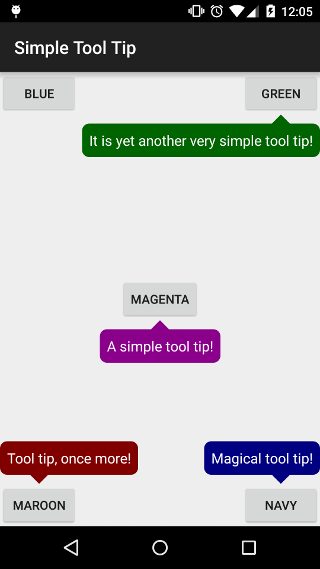

Simple Tool Tip
===============

A simple library to add tool tips to your awesome Android application.



Usage
-------
* You don't need anything special in your layout XML file:
```xml
<?xml version="1.0" encoding="utf-8"?>
<FrameLayout xmlns:android="http://schemas.android.com/apk/res/android"
    android:layout_width="match_parent"
    android:layout_height="match_parent">
    <Button
        android:id="@+id/button"
        android:layout_width="wrap_content"
        android:layout_height="wrap_content"
        android:layout_gravity="center"
        android:text="Click Me!" />
</FrameLayout>
```
* Then in your Java code:
```java
public class MainActivity extends Activity {
    @Override
    protected void onCreate(Bundle savedInstanceState) {
        super.onCreate(savedInstanceState);

        setContentView(R.layout.activity_main);
        findViewById(R.id.button).setOnClickListener(new View.OnClickListener() {
            @Override
            public void onClick(View v) {
                ToolTip toolTip = new ToolTip.Builder()
                    .withText("Simple Tool Tip!")
                    .build();
                ToolTipView toolTipView = new ToolTipView.Builder(this)
                    .withAnchor(v)
                    .withToolTip(toolTip)
                    .build();
                toolTipView.show();
            }
        });
    }
}
```
* To customize your `ToolTipView`, check the `ToolTip.Builder` class for more details.

License
-------
    Copyright (C) 2015 Xizhi Zhu

    Licensed under the Apache License, Version 2.0 (the "License");
    you may not use this file except in compliance with the License.
    You may obtain a copy of the License at

        http://www.apache.org/licenses/LICENSE-2.0

    Unless required by applicable law or agreed to in writing, software
    distributed under the License is distributed on an "AS IS" BASIS,
    WITHOUT WARRANTIES OR CONDITIONS OF ANY KIND, either express or implied.
    See the License for the specific language governing permissions and
    limitations under the License.
